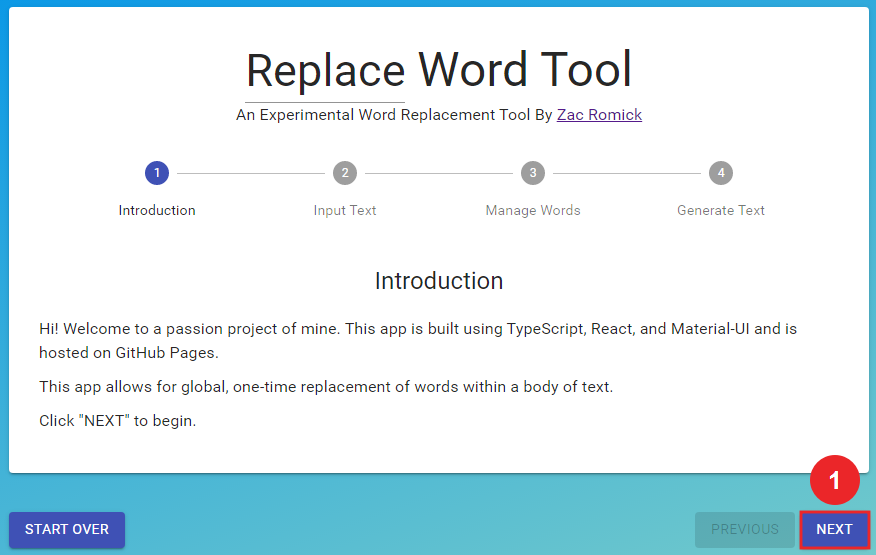
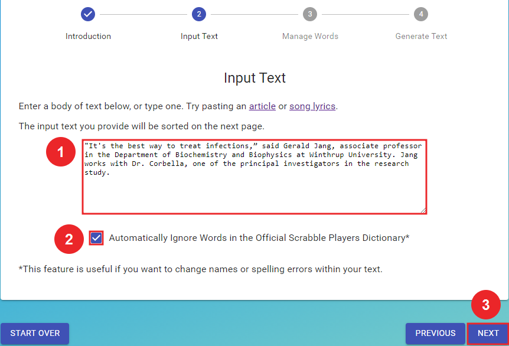
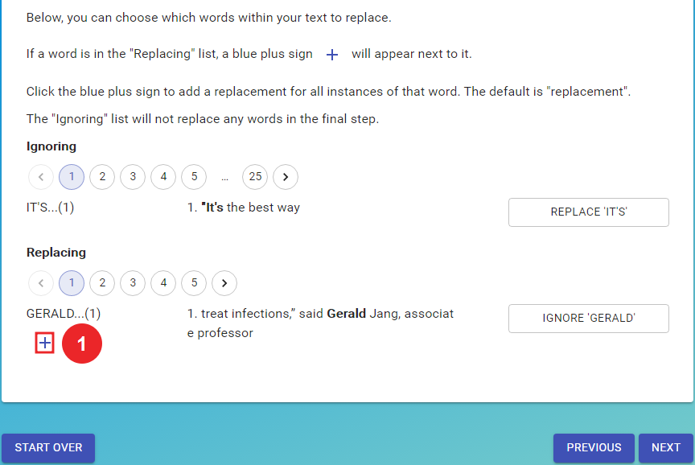
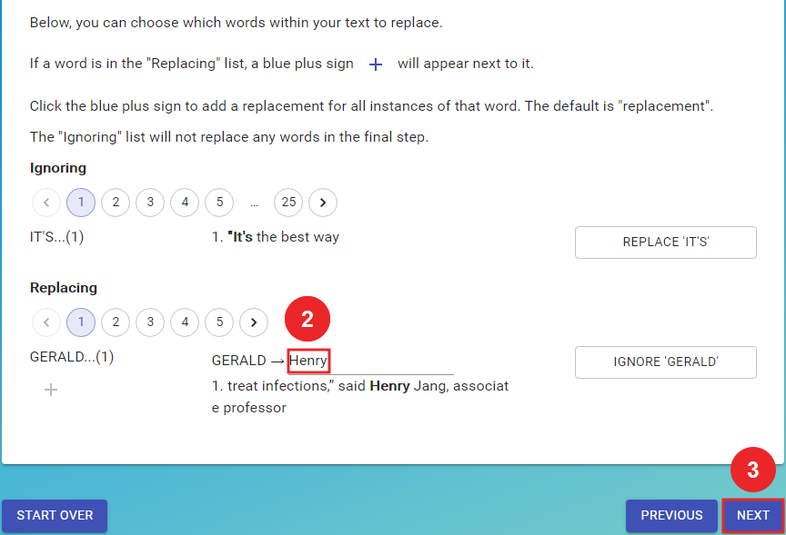
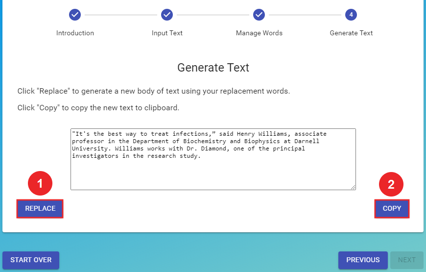

## Replace Word Tool

Hi! Welcome to a passion project of mine. This app is built using TypeScript, React, and Material-UI and is hosted on GitHub Pages.

This app allows for global, one-time replacement of words within a body of text.

Other useful features:
* Visualize word frequency by providing every context in which a word appears throughout a text.
* Identify and change redundant vocabulary.
* Isolates proper nouns and spelling errors. (See example below)

## Workflow Example: Mask Identities in a Published Article

Changing names from this excerpt:

"It's the best way to treat infections,” said *Gerald Jang*, associate professor in the Department of Biochemistry and Biophysics at *Winthrup* University. *Jang* works with Dr. *Corbella*, one of the principal investigators in the research study.

To:

"It's the best way to treat infections,” said *Henry Williams*, associate professor in the Department of Biochemistry and Biophysics at *Darnell* University. *Williams* works with Dr. *Diamond*, one of the principal investigators in the research study.

#### Step 1: INTRODUCTION. Click "Next" to begin.

#### Step 2: INPUT TEXT. Add the text that will be replaced. Check the box next to "Automatically Ignore Words in the Official Scrabble Player's Dictionary" to isolate proper nouns.

#### Step 3: MANAGE WORDS. Click the "+" icon next to each word to create a replacement word.

#### Step 4: GENERATE TEXT. Click "Replace" to generate output text and then "Copy".

